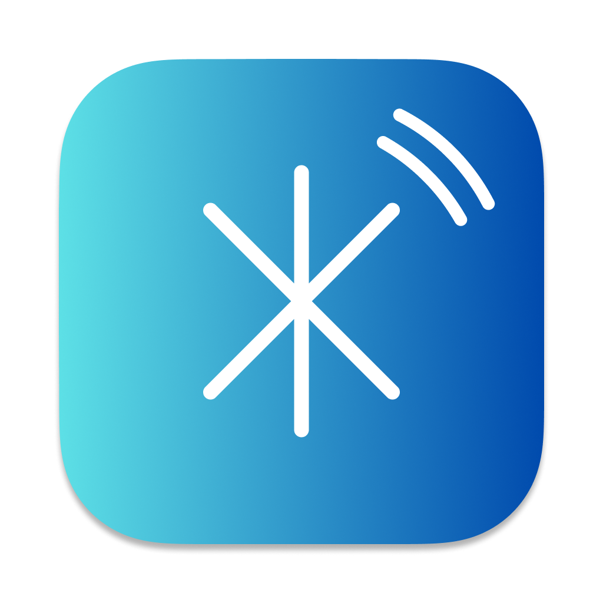

<p align="center">
  
</p>

<h1 align="center">Magic Switch</h1>

A macOS menu-bar utility that hands off Magic Keyboard, Magic Trackpad, and Magic Mouse between two Macs with one click — no KVM, no cables.

This is a security-hardened fork of [HoshimuraYuto/blue-switch](https://github.com/HoshimuraYuto/blue-switch). The original ships an unauthenticated, unencrypted LAN protocol that lets anyone on the same Wi-Fi take over your Bluetooth peripherals or spoof notifications. This fork replaces that channel with a sealed, mutually-authenticated channel keyed by a 12-character pairing code you share between your two Macs — with a massively improved UI/UX over the original: a guided pairing flow, inline status feedback, per-peripheral switching, a needs-attention menu-bar icon, and safe preflight-and-rollback handoffs.

## Installation

1. Grab the latest build from the [releases page](https://github.com/MegaManSec/magic-switch/releases).
2. Unzip and move `Magic Switch.app` to `/Applications`.
3. First launch: macOS will block it because the build isn't signed. Right-click → Open, or System Settings → Privacy & Security → "Open Anyway".
4. Approve **Bluetooth** and **Local Network** access when macOS prompts. Both are required — Bluetooth to control the peripherals, Local Network to discover and talk to the other Mac. If you dismiss the prompts, grant them later under System Settings → Privacy & Security.

## Setup

Four Settings tabs to know — two of them use the word "pair" in different senses, which can be confusing:

- **Peripheral** — the Bluetooth devices Magic Switch hands back and forth (Magic Keyboard / Mouse / Trackpad).
- **Device** — the *other Mac on your network* you're swapping with.
- **Pairing** — a cryptographic shared key between the two Macs. *Required.* This is **not** the Bluetooth pairing in step 1 — that's between your peripherals and each Mac, done in System Settings. This one is between the two Macs themselves, done inside Magic Switch.
- **Other** — app preferences: turn on **Launch at Login**, see the installed version, and get notified about updates (see [Updates](#updates)).

Do this on **both** Macs.

1. **In System Settings → Bluetooth on each Mac**, pair your Magic Keyboard / Mouse / Trackpad to *that* Mac the normal macOS way — **each peripheral has to be paired to both Macs**. Apple's Magic devices remember multiple hosts but only connect to one at a time; Magic Switch flips which Mac currently holds a peripheral, but it doesn't create those pairings for you — set them up on both Macs in System Settings first. (Once that's done, you won't re-pair by hand on every switch — Magic Switch handles the handoff.)
2. Launch Magic Switch. Grant **Bluetooth** and **Local Network** permission when prompted.
3. Right-click the menu-bar icon → Settings:
   - **Peripheral** tab: tick the Magic devices you want Magic Switch to manage.
   - **Device** tab: pick the other Mac from "Available Devices."
4. **Pairing** tab — *required*:
   - On one Mac, click "Generate Code." A twelve-character code appears.
   - On the other, click "Enter Code" and type it in.
   - Both Macs should show the same eight-character fingerprint after pairing. If they don't, you typed the code wrong.
5. Sync your peripheral list to the other Mac: on the **Device** tab, find it under **Connected Devices** and click its **share button** (the box-with-an-up-arrow icon, beside **Ping**). A "Synced N peripherals to …" line appears under the row on success. The button is greyed out while that Mac is offline.

Until step 4 completes, the switch action and peripheral sync refuse to talk to the peer.

## Usage

| Action                                  | Result                                                                                          |
| --------------------------------------- | ----------------------------------------------------------------------------------------------- |
| Click the menu-bar icon (either button) | Open the menu |
| Menu → a Mac | Hand all peripherals between this Mac and that one |
| Menu → a peripheral | Switch just that one peripheral. Checkmark = currently on this Mac |
| Menu → Settings | Open the Settings window |

The menu-bar icon also signals state: a **warning triangle** means Magic Switch needs attention (not paired, or Bluetooth off/denied) — hover for the reason; **up/down arrows** flash briefly while peripherals are moving between Macs.

## Updates

Magic Switch tells you when there's a new version — it never updates itself. About once a day it makes a single anonymous request to GitHub's public releases API for [this repo](https://github.com/MegaManSec/magic-switch/releases) and compares your installed version with the latest published release; no account, sign-in, or telemetry is involved. When a newer version exists, an **Update Available** notice (with the new version number) appears at the top of the right-click menu and in **Settings → Other** — clicking it opens the release page so you can download and install it yourself. A failed check (offline, rate-limited, etc.) is retried about hourly; otherwise checks happen at most once every 24 hours. Your installed version is always shown in **Settings → Other**.

## Troubleshooting

- Both Macs running Magic Switch, both showing "Paired" in the Pairing tab.
- Devices powered on; Bluetooth enabled.
- Same network; not blocked by firewall.
- Bluetooth and Local Network permissions granted in System Settings → Privacy & Security.
- A **greyed-out device** — in the Device tab or the right-click menu — means it isn't reachable on the network right now (the other Mac is asleep, off Wi-Fi, or not running Magic Switch). Ping, Sync, and switching stay disabled until it's back online.
- On the **Device** tab, **Ping** tests whether the two Macs can reach each other over the secure channel.

## Developer notes

Requirements: Xcode 16.1+ (Swift 5 language mode).

Build:
```bash
xcodebuild -project "Magic Switch.xcodeproj" -scheme "Magic Switch" -configuration Debug build
```

Format on commit (optional):
```bash
sh ./setup-hooks.sh
```

This sets `core.hooksPath` to the in-repo `.hooks/` directory, so be aware you're trusting whatever lives there in your current checkout.

## Architecture

Two Macs discover each other over Bonjour, then exchange short commands over a sealed TCP channel keyed by the shared pairing code.

```
                  Bonjour discovery (_magicswitch._tcp. in local.)
                 ┌──────────────────────────────────────────────────┐
                 │                                                  │
                 ▼                                                  ▼
   ┌────────────────────────────┐                    ┌────────────────────────────┐
   │  Mac A — Magic Switch      │                    │  Mac B — Magic Switch      │
   │                            │                    │                            │
   │   AppDelegate              │                    │   AppDelegate              │
   │   (status item, menu)      │                    │   (status item, menu)      │
   │       │         ▲          │                    │       │         ▲          │
   │       ▼         │          │     sealed TCP     │       ▼         │          │
   │   Outgoing  Incoming       │◀── ChaCha20-Poly ─▶│   Outgoing  Incoming       │
   │   Conn.     Conn.          │    (per session)   │   Conn.     Conn.          │
   │       │         │          │                    │       │         │          │
   │       ▼         ▼          │                    │       ▼         ▼          │
   │   NetworkDeviceStore       │                    │   NetworkDeviceStore       │
   │   BluetoothPeripheralStore │                    │   BluetoothPeripheralStore │
   │   PairingStore             │                    │   PairingStore             │
   │       │                    │                    │       │                    │
   │       ▼ IOBluetooth        │                    │       ▼ IOBluetooth        │
   │   Magic Keyboard           │ one host at a time │   Magic Keyboard           │
   │   Magic Trackpad           │ (peripherals owned │   Magic Trackpad           │
   │   Magic Mouse              │  by whichever Mac  │   Magic Mouse              │
   │                            │  took them last)   │                            │
   └────────────────────────────┘                    └────────────────────────────┘
```

## Security model

The LAN channel uses a shared symmetric key derived from the twelve-character pairing code via PBKDF2-HMAC-SHA256 (600k iterations) and stored in the Keychain. Per connection, both sides exchange a 32-byte nonce and derive direction-specific session keys via HKDF; messages are framed as length-prefixed ChaCha20-Poly1305 sealed boxes with monotonic counter nonces. Failed authentications are rate-limited per source IP (5 failures / 60s → 15-minute block), and the client side backs off after 5 failed outgoing attempts in the same window.

Each Mac pins the other's key fingerprint the first time it sees it (trust on first use). If a later advertisement carries a *different* fingerprint, that peer is dropped and the Device tab makes you explicitly **Trust** the new identity before switching resumes — so a key change or impersonation attempt is surfaced rather than silently accepted.

Known limits:
- The build isn't code-signed or notarized.
- Sixty bits of entropy in the pairing code is fine against an online attacker (rate limit makes brute force infeasible) but theoretically grindable offline if someone captures ciphertext. PBKDF2 stretching pushes the cost up but doesn't eliminate it; a PAKE would close the gap and is the obvious next step.

## License

GNU GPL v3.0. See [LICENSE](LICENSE).
