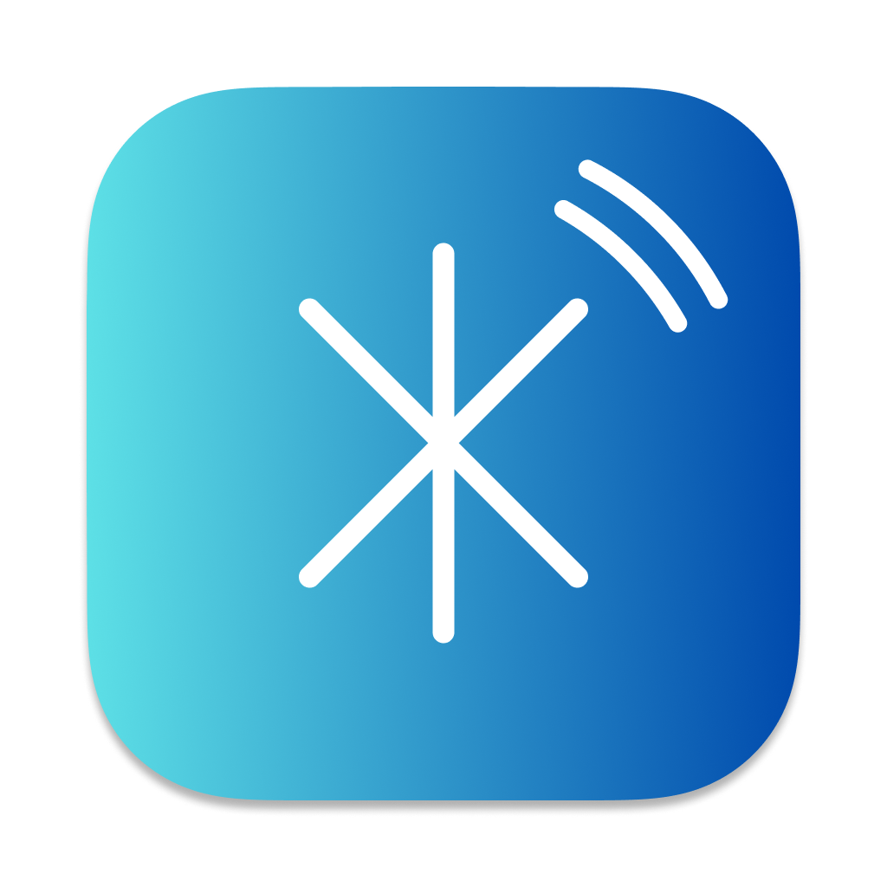
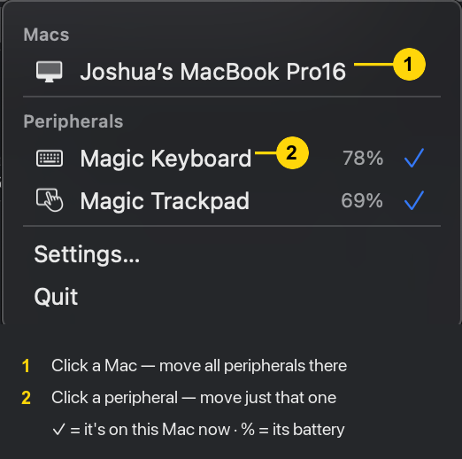
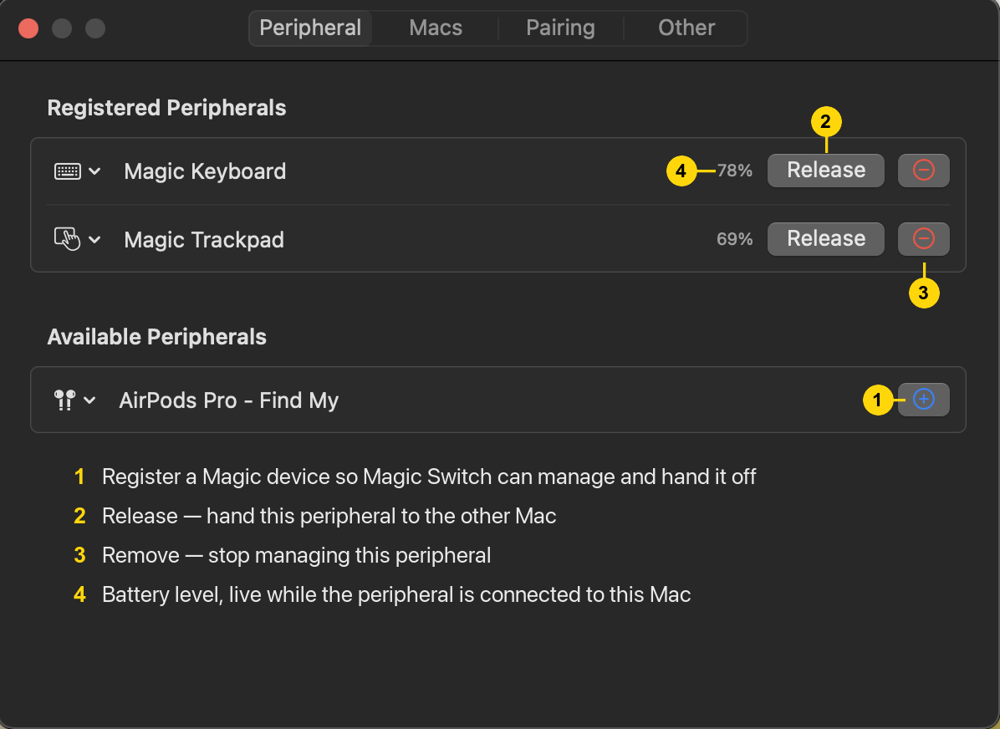
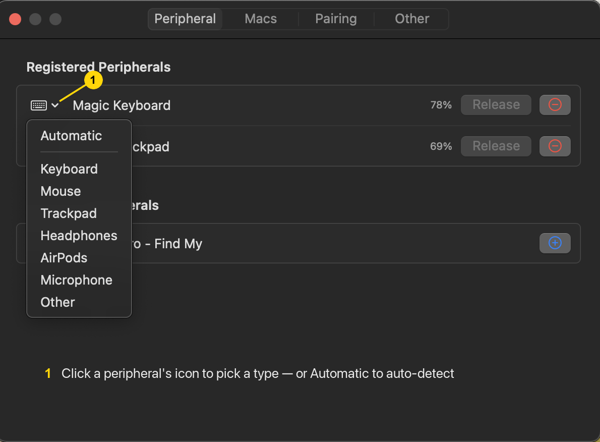
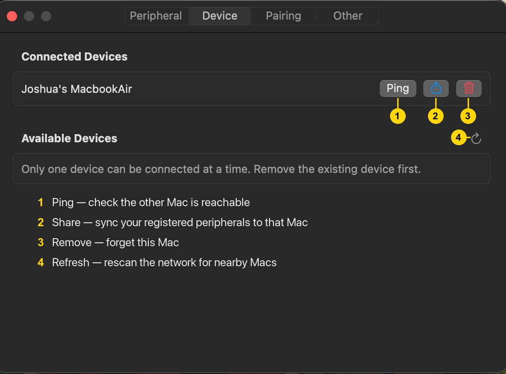
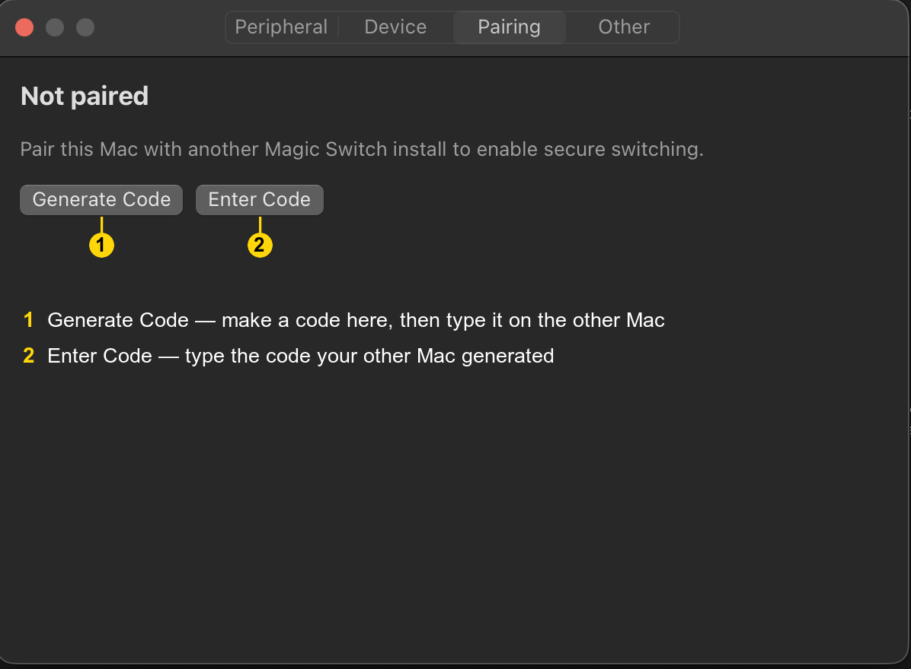
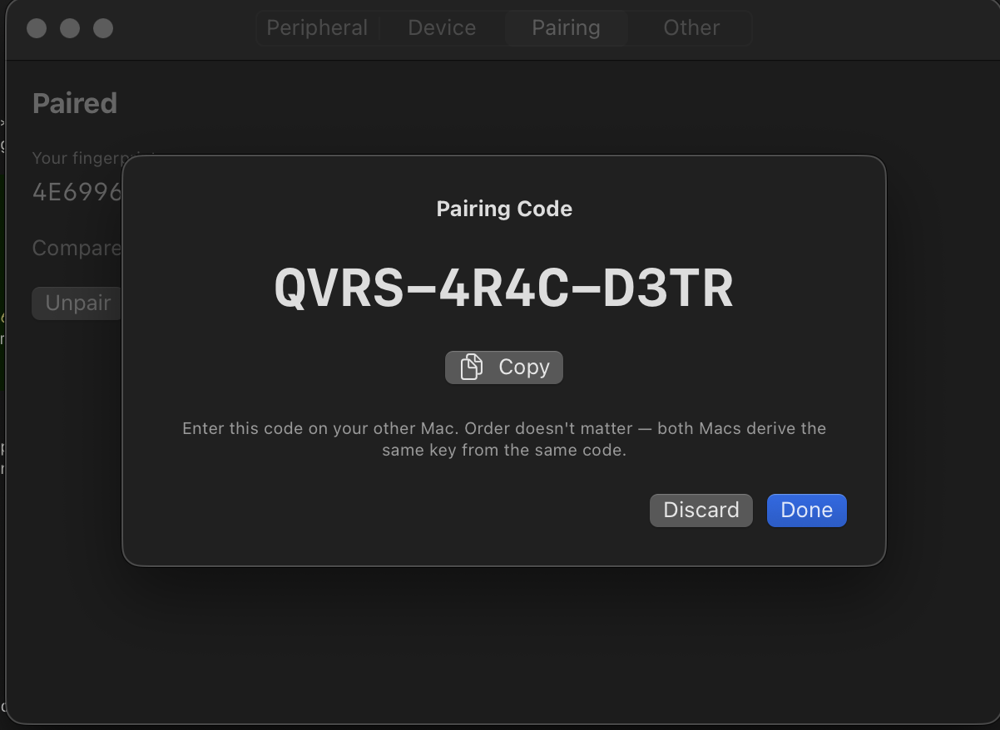
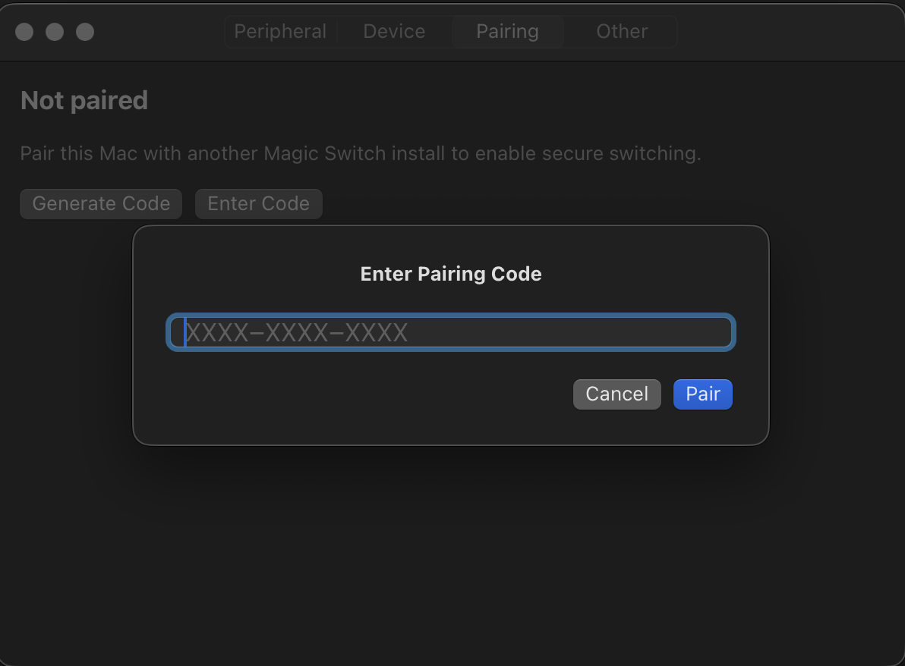
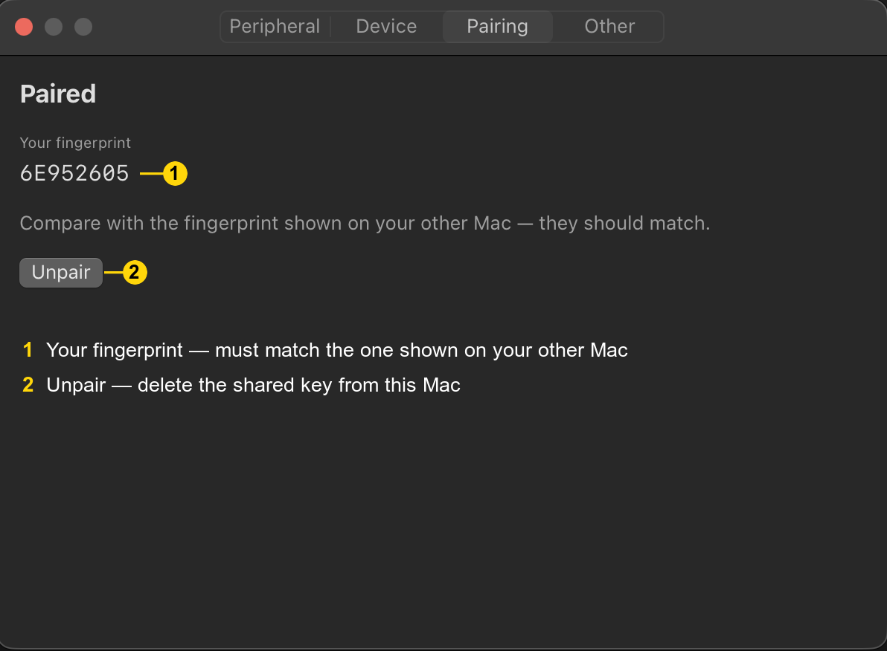
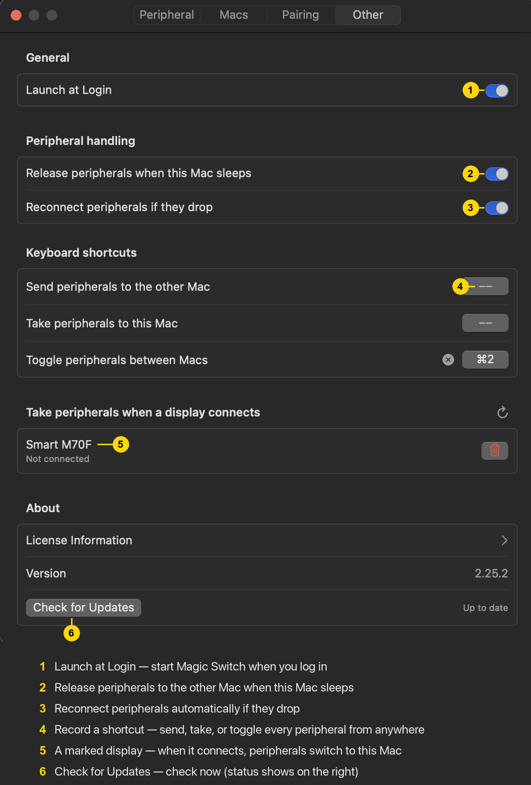

<p align="center">
  
</p>

<h1 align="center">Magic Switch</h1>

A macOS menu-bar utility that hands off Magic Keyboard, Magic Trackpad, and Magic Mouse between two Macs with one click — no KVM, no cables.

This is a security-hardened fork of [HoshimuraYuto/blue-switch](https://github.com/HoshimuraYuto/blue-switch). The original ships an unauthenticated, unencrypted LAN protocol that lets anyone on the same Wi-Fi take over your Bluetooth peripherals or spoof notifications. This fork replaces that channel with a sealed, mutually-authenticated channel keyed by a 12-character pairing code you share between your two Macs — with a massively improved UI/UX over the original: a guided pairing flow, inline status feedback, per-peripheral switching, a needs-attention menu-bar icon, and safe preflight-and-rollback handoffs.

<p align="center">
  <br>
  <em>It lives in the menu bar: click a Mac to move every peripheral to it, or a single peripheral to move just that one. A checkmark marks whatever's on this Mac right now.</em>
</p>

## Installation

1. Grab the latest build from the [releases page](https://github.com/MegaManSec/magic-switch/releases).
2. Unzip and move `Magic Switch.app` to `/Applications`.
3. First launch: macOS will block it because the build isn't signed. Right-click → Open, or System Settings → Privacy & Security → "Open Anyway".
4. Approve **Bluetooth** and **Local Network** access when macOS prompts. Both are required — Bluetooth to control the peripherals, Local Network to discover and talk to the other Mac. If you dismiss the prompts, grant them later under System Settings → Privacy & Security.
5. Allow **Notifications** when asked. Not strictly required, but it's how Magic Switch reports what happened when no window is open — a switch triggered by hotkey, URL scheme, or dock-on-display that fails does so *silently* without it (see [Troubleshooting](#troubleshooting)). Denied it once? Re-enable under System Settings → Notifications → Magic Switch.

## Setup

Magic Switch has four Settings tabs, and two of them use the word "pair" in different senses — which trips people up. **Pairing** is the cryptographic key shared between the two *Macs* (required, and set up inside Magic Switch); the Bluetooth pairing of your *peripherals* is a separate thing, done in System Settings. Do everything below on **both** Macs.

### 1. Pair your peripherals to each Mac (System Settings)

In **System Settings → Bluetooth on each Mac**, pair your Magic Keyboard / Mouse / Trackpad to *that* Mac the normal macOS way — **each peripheral has to be paired to both Macs**. Apple's Magic devices remember multiple hosts but only connect to one at a time; Magic Switch flips which Mac currently holds a peripheral, but it doesn't create those pairings for you. (Once that's done, you won't re-pair by hand on every switch — Magic Switch handles the handoff.)

Then launch Magic Switch, grant **Bluetooth** and **Local Network** when prompted, and right-click the menu-bar icon → **Settings**.

### 2. Peripheral tab — choose what to manage

Tick the Magic devices you want Magic Switch to hand back and forth. Each row's leading icon shows the detected device type; click it to override the type or reset it to Automatic.

<p align="center">
  <br>
  <em>Peripheral tab — register the Magic devices you want to hand off. Each row's leading icon shows the detected device type.</em>
</p>

<p align="center">
  <br>
  <em>That leading icon is also a picker — Magic Switch auto-detects the type (keyboard, mouse, trackpad, headphones, AirPods, microphone), and you can override it or set it back to Automatic.</em>
</p>

### 3. Macs tab — pick the other Mac

Choose the other Mac under **Macs Found on the Network**. It shows up once it's on the same network running Magic Switch; a greyed-out row means it isn't reachable right now.

If your network blocks Bonjour (some MDM-managed Macs can't advertise; some Wi-Fi networks filter multicast), the other Mac may never appear here. Use the **+** button to add it by IP address instead — the sheet on each Mac shows the address and port to enter on the other one, and one side is enough: the other Mac then lists this one automatically. Magic Switch listens on TCP port **41952**; allow it through any firewall between the two Macs.

<p align="center">
  <br>
  <em>Macs tab — pick the other Mac, sync peripherals to it, and check it's reachable.</em>
</p>

### 4. Pairing tab — link the two Macs (required)

Generate a twelve-character code on one Mac and enter it on the other; either direction works, since both Macs derive the same key from the same code. They should then show the same eight-character fingerprint — if they differ, the code was mistyped. Until this is done, switching and peripheral sync refuse to talk to the peer.

<p align="center">
  <br>
  <em>Before pairing — Generate a code on one Mac; Enter it on the other.</em>
</p>

<p align="center">
  
  <br>
  <em>Left: the code one Mac generates (Copy it). Right: type that code on the other Mac.</em>
</p>

<p align="center">
  <br>
  <em>After pairing — both Macs show the same fingerprint. If they differ, the code was mistyped.</em>
</p>

### 5. Sync your peripherals to the other Mac

On the **Macs** tab, find the other Mac under **Your Other Mac** and click its **Sync** button (the circular arrows, beside **Ping**). A "Synced N peripherals to …" line confirms it. The button is greyed out while that Mac is offline.

### Other tab — preferences

**Launch at Login**, recordable **keyboard shortcuts** that send, take, or toggle every peripheral from anywhere in macOS, two peripheral-handling toggles (**Release peripherals when this Mac sleeps** and **Reconnect peripherals if they drop** — see [Troubleshooting](#troubleshooting)), a **Take peripherals when a display connects** list (mark a display to make docking this Mac to it switch your peripherals over automatically — see [Troubleshooting](#troubleshooting)), the installed version, and update notifications (see [Updates](#updates)). A **"Notifications are off"** warning appears at the top of this tab when macOS notifications are disabled for Magic Switch — see [Troubleshooting](#troubleshooting) for why that matters.

<p align="center">
  <br>
  <em>Other tab — Launch at Login, the sleep-release and auto-reconnect toggles, license info, version, and a manual update check.</em>
</p>

## Usage

| Action                                  | Result                                                                                          |
| --------------------------------------- | ----------------------------------------------------------------------------------------------- |
| Click the menu-bar icon (either button) | Open the menu |
| Menu → a Mac | Hand all peripherals between this Mac and that one |
| Menu → a peripheral | Switch just that one peripheral. Checkmark = currently on this Mac, with its battery level |
| Menu → Settings | Open the Settings window |

The menu-bar icon also signals state: a **warning triangle** means Magic Switch needs attention (not paired, or Bluetooth off/denied) — hover for the reason; **up/down arrows** flash briefly while peripherals are moving between Macs (the dropdown is pictured at the top of this README).

### Trigger switches from anything (URL scheme)

For the common cases — a hotkey that sends, takes, or toggles the whole set — you don't need any of this: record them under **Settings → Other → Keyboard shortcuts**. For anything fancier (per-peripheral switches, scripting), Magic Switch registers the `magicswitch://` URL scheme, so anything that can open a URL — a hotkey utility (Raycast, BetterTouchTool, skhd), a mouse-button macro, the Shortcuts app, a shell script — can trigger the same switches as the menu:

```bash
open -g "magicswitch://switch"                                      # everything — same as clicking the other Mac in the menu
open -g "magicswitch://switch?direction=take"                       # bring everything to this Mac
open -g "magicswitch://switch?peripheral=trackpad&direction=take"   # just the trackpad(s)
open -g "magicswitch://switch?peripheral=trackpad&peripheral=mouse" # repeat peripheral= for several
```

(`-g` keeps your current app focused.) Parameters:

- `peripheral` *(repeatable)* — which peripherals to move; omit it for the whole registered set. Each value is matched as a MAC address (`aa-bb-cc-dd-ee-ff`), else as a type keyword (`keyboard`, `mouse`, `trackpad`, `headphones`, `airpods`, `microphone`), else as a device name (case-insensitive).
- `direction` — `take` (bring to this Mac), `send` (move to the other Mac), or `toggle` (the default: move each to whichever Mac doesn't have it, exactly like a menu click). `take` and `send` are idempotent, so they're the ones to bind to hotkeys — repeating one is a no-op instead of bouncing peripherals back.

Run the command on the Mac that should act. `direction=take` works even while the other Mac is asleep or off the network — an unreachable Mac isn't holding the peripherals anymore, so they're grabbed directly. Errors (a mistyped parameter, a peripheral that matches nothing) surface as notifications, and anything mid-handoff is left alone.

## Updates

Magic Switch tells you when there's a new version — it never updates itself. About once a day it makes a single anonymous request to GitHub's public releases API for [this repo](https://github.com/MegaManSec/magic-switch/releases) and compares your installed version with the latest published release; no account, sign-in, or telemetry is involved. When a newer version exists, an **Update Available** notice (with the new version number) appears at the top of the right-click menu and in **Settings → Other** — clicking it opens the release page so you can download and install it yourself. A failed check (offline, rate-limited, etc.) is retried about hourly; otherwise checks happen at most once every 24 hours. Your installed version is always shown in **Settings → Other**.

## Troubleshooting

- Both Macs running Magic Switch, both showing "Paired" in the Pairing tab.
- Devices powered on; Bluetooth enabled.
- Same network; TCP port 41952 not blocked by firewall.
- Bluetooth and Local Network permissions granted in System Settings → Privacy & Security.
- A **greyed-out device** — in the Macs tab or the right-click menu — means it isn't reachable on the network right now (the other Mac is asleep, off Wi-Fi, or not running Magic Switch). Ping, Sync, and switching stay disabled until it's back online.
- **A switch failed and nothing told you.** Failures — a peripheral that won't connect, a Mac that can't be reached, an identity mismatch — are reported via system notifications, because a hotkey, URL-scheme, or automatic switch has no window to show an error in. If macOS notifications are off for Magic Switch, those failures are completely silent; **Settings → Other** shows a **"Notifications are off"** warning when that's the case. Re-enable them under System Settings → Notifications → Magic Switch. (The Pairing and Macs tabs also show their errors inline, so actions taken *there* still report failures either way.)
- On the **Macs** tab, **Ping** tests whether the two Macs can reach each other over the secure channel.
- **Closing or sleeping one Mac hands its peripherals to the other.** When this Mac sleeps (or you close its lid), it hands the peripherals it holds to your other Mac — or, if that Mac isn't reachable yet, frees them so it can pick them up the moment it wakes. That's why you can close one Mac and find the keyboard and mouse already on the other. This is on by default; you can turn it off under **Settings → Other → "Release peripherals when this Mac sleeps."**
- **A peripheral didn't come back after sleep or a lid-close.** Apple's Magic devices sometimes get stuck once the Bluetooth radio sleeps and won't reconnect — even a manual reconnect fails until you switch the peripheral **off and on** with its power switch. Magic Switch keeps watching for anything that was on this Mac before it slept: the moment the device reappears (which a power-cycle triggers), it reconnects automatically — as long as your other Mac isn't actively using it. This is on by default; you can turn it off under **Settings → Other → "Reconnect peripherals if they drop."**
- **Both Macs slept, and now a peripheral connects to neither.** When this Mac sleeps, it frees its peripherals for your other Mac to take (see above). If the other Mac never takes them — it was asleep too, or off the network the whole time — they end up attached to no Mac at all, and a Magic device in that state stops listening for connections after a short while; no Mac can reach it until it's woken up. When this Mac wakes it immediately tries to grab everything it freed, so a round trip usually recovers on its own — clicking or pressing a key on the peripheral within the first minute after opening the lid helps it get caught. If a peripheral still won't respond, this is the one situation where you have to help: flick its power switch **off and on**, and Magic Switch reconnects it the moment it comes back up. If that trade-off doesn't suit how you use your Macs, turn off **Settings → Other → "Release peripherals when this Mac sleeps"** — peripherals then stay bonded to this Mac across sleep (and reconnect instantly on wake), at the cost of the other Mac needing the same power-cycle help if you switch desks while this Mac sleeps.
- **Docking to a marked display switches peripherals automatically.** Under **Settings → Other → "Take peripherals when a display connects,"** every external display connected to this Mac gets a toggle. Mark your desk's display and, whenever it connects to this Mac — plugging in the cable, or opening the lid of a MacBook that was docked while it slept — Magic Switch switches your peripherals to this Mac, taking them from your other Mac if needed. Displays are recognized individually, so two identical monitors aren't confused; waking while already docked doesn't count as docking; and a display that's already connected when Magic Switch starts doesn't trigger a switch. This is off until you mark a display.

## Developer notes

Requirements: Xcode 16.1+ (Swift 5 language mode).

Build:
```bash
xcodebuild -project "Magic Switch.xcodeproj" -scheme "Magic Switch" -configuration Debug build
```

Format on commit (optional):
```bash
sh ./setup-hooks.sh
```

This sets `core.hooksPath` to the in-repo `.hooks/` directory, so be aware you're trusting whatever lives there in your current checkout.

## Architecture

Two Macs discover each other over Bonjour, then exchange short commands over a sealed TCP channel keyed by the shared pairing code. Where Bonjour can't carry advertisements, the channel doubles as discovery: every reachability probe is an INTRODUCE exchange that refreshes both sides' endpoints over the authenticated connection, and a Mac can be bootstrapped by IP address from the Macs tab.

```
                  Bonjour discovery (_magicswitch._tcp. in local.)
                 ┌──────────────────────────────────────────────────┐
                 │                                                  │
                 ▼                                                  ▼
   ┌────────────────────────────┐                    ┌────────────────────────────┐
   │  Mac A — Magic Switch      │                    │  Mac B — Magic Switch      │
   │                            │                    │                            │
   │   AppDelegate              │                    │   AppDelegate              │
   │   (status item, menu)      │                    │   (status item, menu)      │
   │       │         ▲          │                    │       │         ▲          │
   │       ▼         │          │     sealed TCP     │       ▼         │          │
   │   Outgoing  Incoming       │◀── ChaCha20-Poly ─▶│   Outgoing  Incoming       │
   │   Conn.     Conn.          │    (per session)   │   Conn.     Conn.          │
   │       │         │          │                    │       │         │          │
   │       ▼         ▼          │                    │       ▼         ▼          │
   │   NetworkDeviceStore       │                    │   NetworkDeviceStore       │
   │   BluetoothPeripheralStore │                    │   BluetoothPeripheralStore │
   │   PairingStore             │                    │   PairingStore             │
   │       │                    │                    │       │                    │
   │       ▼ IOBluetooth        │                    │       ▼ IOBluetooth        │
   │   Magic Keyboard           │ one host at a time │   Magic Keyboard           │
   │   Magic Trackpad           │ (peripherals owned │   Magic Trackpad           │
   │   Magic Mouse              │  by whichever Mac  │   Magic Mouse              │
   │                            │  took them last)   │                            │
   └────────────────────────────┘                    └────────────────────────────┘
```

## Security model

The LAN channel uses a shared symmetric key derived from the twelve-character pairing code via PBKDF2-HMAC-SHA256 (600k iterations) and stored in the Keychain. Per connection, both sides exchange a 32-byte nonce and derive direction-specific session keys via HKDF; messages are framed as length-prefixed ChaCha20-Poly1305 sealed boxes with monotonic counter nonces. Failed authentications are rate-limited per source IP (5 failures / 60s → 15-minute block), and the client side backs off after 5 failed outgoing attempts in the same window.

Each Mac pins the other's key fingerprint the first time it sees it (trust on first use). If a later advertisement carries a *different* fingerprint, switching *to* that peer is paused and the Macs tab asks you to explicitly **Trust** the new identity — so a key change is surfaced rather than silently accepted. The fingerprint is a hash of the *shared* pairing key, not a per-machine identity, so a peer that completes the authenticated handshake has proved strictly more than the advertisement claims: if it proves it holds this Mac's current key while the pending fingerprint is exactly that key's, the warning resolves itself (the state a mutual re-pair leaves behind). A peer that cannot complete the handshake is rejected outright, whatever it advertises.

Known limits:
- The build isn't code-signed or notarized.
- On some systems an ad-hoc-signed build can't register with Notification Center at all, so failure notifications never fire no matter what the permission says; the Pairing and Macs tabs surface their errors inline as a fallback.
- Sixty bits of entropy in the pairing code is fine against an online attacker (rate limit makes brute force infeasible) but theoretically grindable offline if someone captures ciphertext. PBKDF2 stretching pushes the cost up but doesn't eliminate it; a PAKE would close the gap and is the obvious next step.

## License

GNU GPL v3.0. See [LICENSE](LICENSE).
